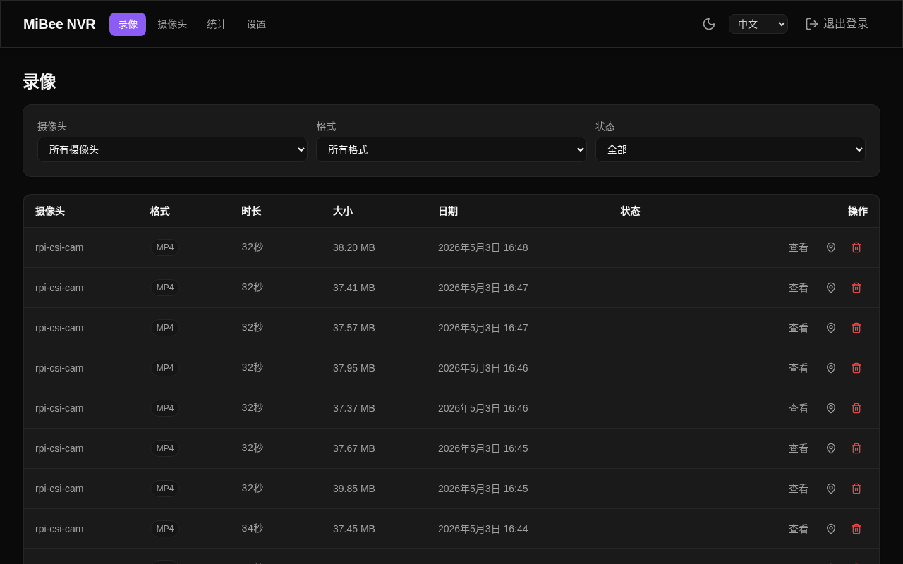
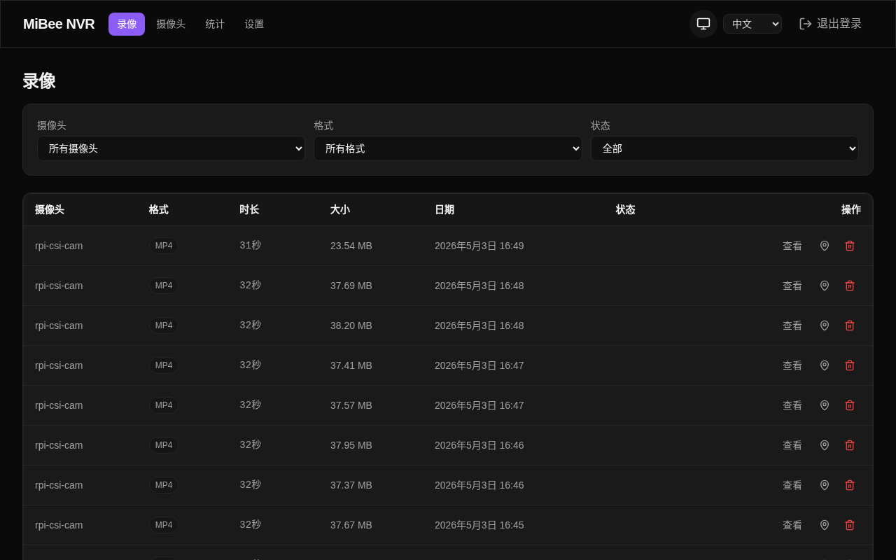
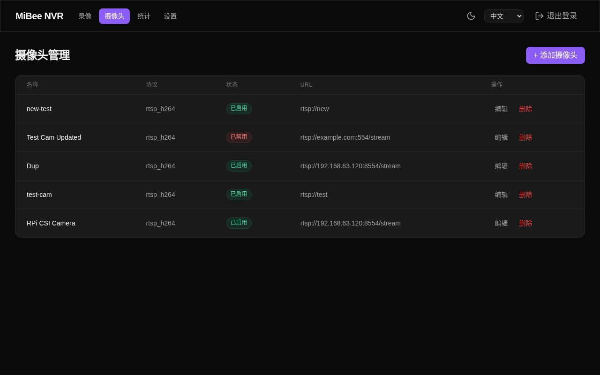
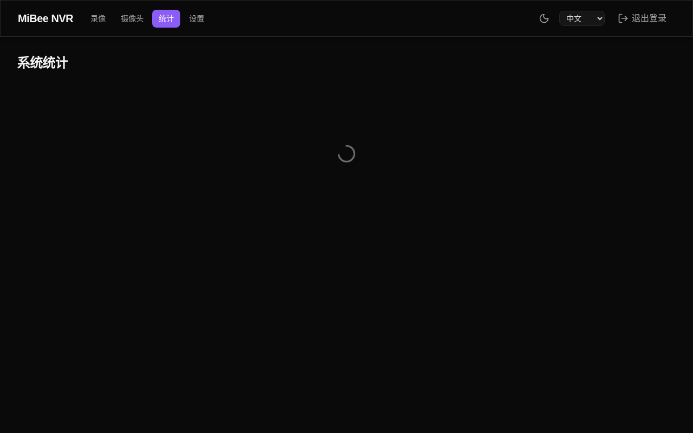
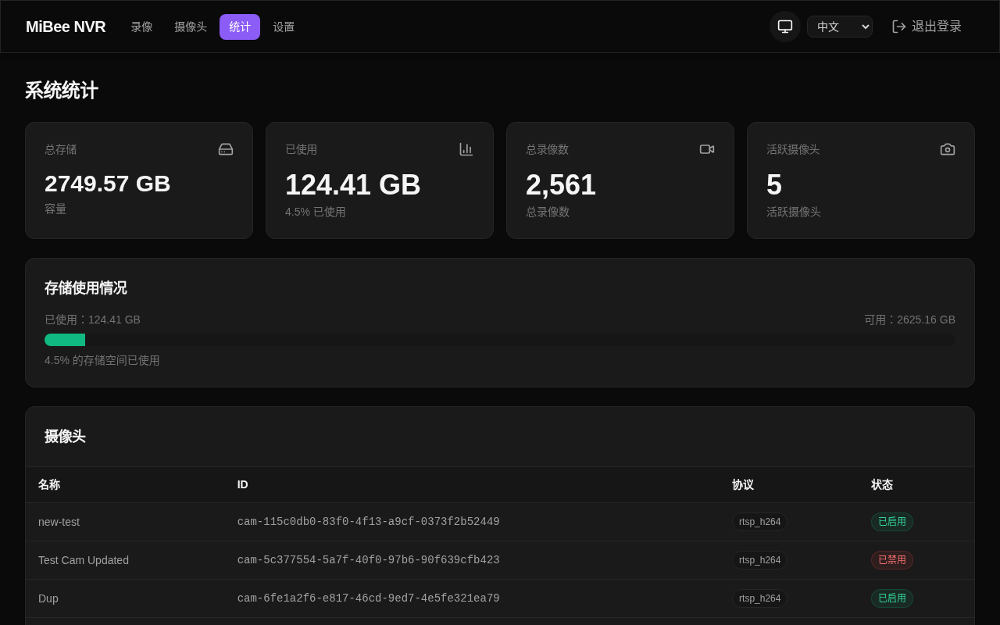
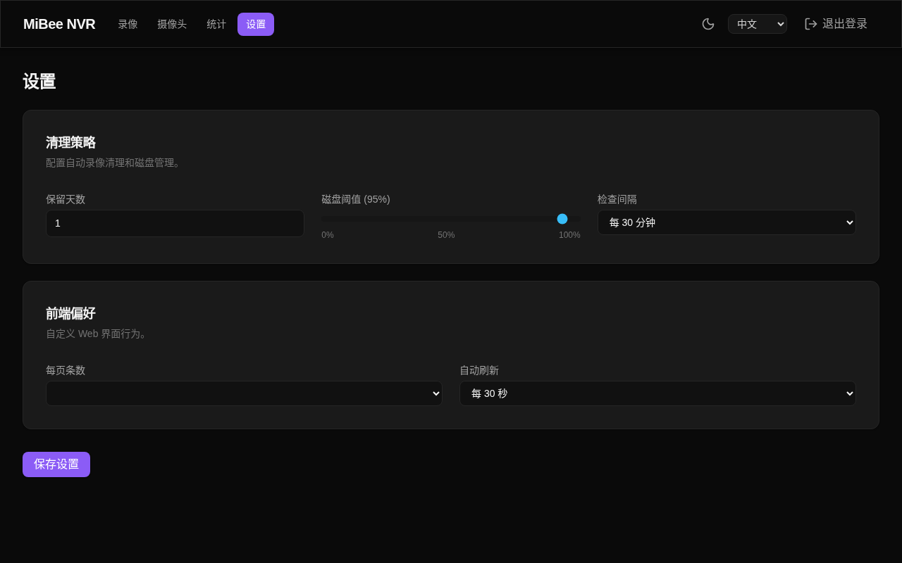

# Go NVR

轻量级网络视频录像机，使用 Go 编写。支持 RTSP (H.264/H.265/MJPEG) 和 HTTP JPEG 摄像头，内置 Web 管理界面、WebDAV、FTP 和 MQTT 集成。编译为单文件静态二进制，内嵌前端页面，无需外部依赖。

[**English**](README.md)

## 截图








## 功能特性

- 支持 RTSP (H.264/H.265/MJPEG)、HTTP JPEG 和 ONVIF 摄像头
- 自动将视频流封装为 MP4 片段存储
- Web 管理界面，支持 **深色/浅色主题**（自动检测系统偏好）
- **Chart.js** 驱动的存储趋势和单摄像头统计图表
- **实时直播 (HLS流)** - 通过 Web UI 按需 H.264/H.265 直播流
- **lucide-svelte** 图标贯穿整个界面
- **i18n** 支持：中英文语言切换
- **响应式设计**，适配移动端和桌面端
- WebDAV（可配置只读/读写）和 FTP 文件访问
- MQTT 消息触发录像，灵活集成智能家居
- 多摄像头同时录像
- **按摄像头保留天数** - 每个摄像头可以有自己的保留策略
- 自动清理过期录像，支持磁盘空间阈值
- **视频段合并** — 可配置的自动合并，支持全局 + 按摄像头策略，仪表盘监控
- SQLite 存储元数据
- 单文件部署，无外部依赖 (`CGO_ENABLED=0`)
## 快速开始

### 方式 1：预编译二进制（推荐）

从 [GitHub Releases](https://github.com/beyondChang/go-nvr/releases) 下载最新二进制文件：

```bash
# AMD64（大多数 PC/服务器）
wget https://github.com/beyondChang/go-nvr/releases/latest/download/go-nvr-amd64
chmod +x go-nvr-amd64

# ARM64（树莓派等）
wget https://github.com/beyondChang/go-nvr/releases/latest/download/go-nvr-arm64
chmod +x go-nvr-arm64
```

初始化配置并启动：

```bash
./go-nvr-amd64 init --password yourpassword
./go-nvr-amd64 -config go-nvr.yaml
```

打开 `http://localhost:9090` 即可访问管理界面。

### 方式 2：Docker

```bash
mkdir -p data
cp config.example.yaml data/go-nvr.yaml
# 编辑 data/go-nvr.yaml — 设置密码、添加摄像头
docker compose up -d
```

打开 `http://localhost:9090` 即可访问管理界面。详见 [`docker-compose.yml`](docker-compose.yml)。

### 方式 3：一键安装脚本

```bash
curl -fsSL https://raw.githubusercontent.com/Mi-Bee-Studio/go-nvr/main/install.sh | sudo bash
```

自动下载二进制文件、创建系统用户（`nvr`）、生成配置、安装 systemd 服务并启动。数据目录：`/var/lib/go-nvr`。

### 方式 4：源码编译

```bash
git clone https://github.com/beyondChang/go-nvr.git
cd go-nvr
make build
./go-nvr init --password yourpassword
./go-nvr -config go-nvr.yaml
```

详细设置请参考 [快速入门](docs/zh/getting-started.md)。

## 文档

| 文档 | 说明 |
|------|------|
| [快速入门](docs/zh/getting-started.md) | 安装、添加第一个摄像头 |
| [配置说明](docs/zh/configuration.md) | 完整配置参考 |
| [API 文档](docs/zh/api-reference.md) | REST API 接口文档 |
| [MediaMTX 指南](docs/zh/mediamtx-guide.md) | MediaMTX CSI 摄像头集成 |
| [部署指南](docs/zh/deployment.md) | systemd、反向代理、交叉编译 |

```bash
make build              # 本机编译（当前架构）
make cross              # 交叉编译 ARM64 二进制
make test               # 运行测试
make lint               # 代码检查
```

## Docker 容器镜像

快速部署请参考 [`docker-compose.yml`](docker-compose.yml)：

```bash
docker compose up -d
```

支持两种构建方式：

- **多阶段构建**（`Dockerfile`）：在容器内完成前端+后端编译，需要网络拉取基础镜像
- **交叉编译构建**（`Dockerfile.arm64`）：在宿主机交叉编译后打包，无需 QEMU，使用 `scratch` 基础镜像

```bash
# 构建 amd64 镜像（多阶段构建）
make docker-build

# 构建 arm64 镜像（宿主交叉编译 + scratch 打包）
make docker-build-arm64

# 构建全部架构
make docker-build-all

# 推送到镜像仓库（需先 docker/podman login）
make docker-push              # 推送 amd64
make docker-push-arm64        # 推送 arm64
make docker-push-all          # 推送全部

# 一键构建并推送
make docker-release
```

镜像在打版本标签时自动发布到 GitHub Container Registry：

| 镜像 | 架构 |
|------|------|
| `ghcr.io/mi-bee-studio/go-nvr:<tag>` | amd64, arm64 |

可用标签：`latest`、`v1.2.3`（semver）、`sha-abc1234`

## 项目结构

```
cmd/go-nvr/       # 程序入口
internal/            # 核心模块
  api/               # REST API
  camera/            # 摄像头管理
  recorder/          # H.264/H.265/MJPEG 录像引擎
  hls/               # HLS 直播管理器
  storage/           # SQLite 数据库 + 文件管理
  config/            # YAML 配置
  middleware/        # 认证中间件
  muxer/             # MP4 封装器
  ftp/               # FTP 服务
  webdav/            # WebDAV 服务（可配置只读/读写）
  mqtt/              # MQTT 客户端
  ui/                # 内嵌 Web UI
web/                 # Svelte 5 前端
deploy/              # systemd 服务文件
docs/                # 文档（中文/英文）
```

## 贡献

1. 提交前运行 `make lint`
2. 新功能附带测试
3. 清晰的提交信息

## 许可证

[MIT License](LICENSE) © Mi&Bee Studio
